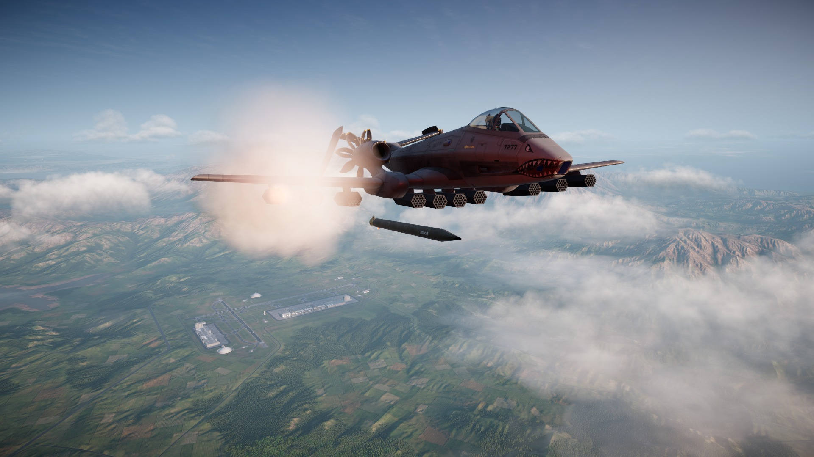
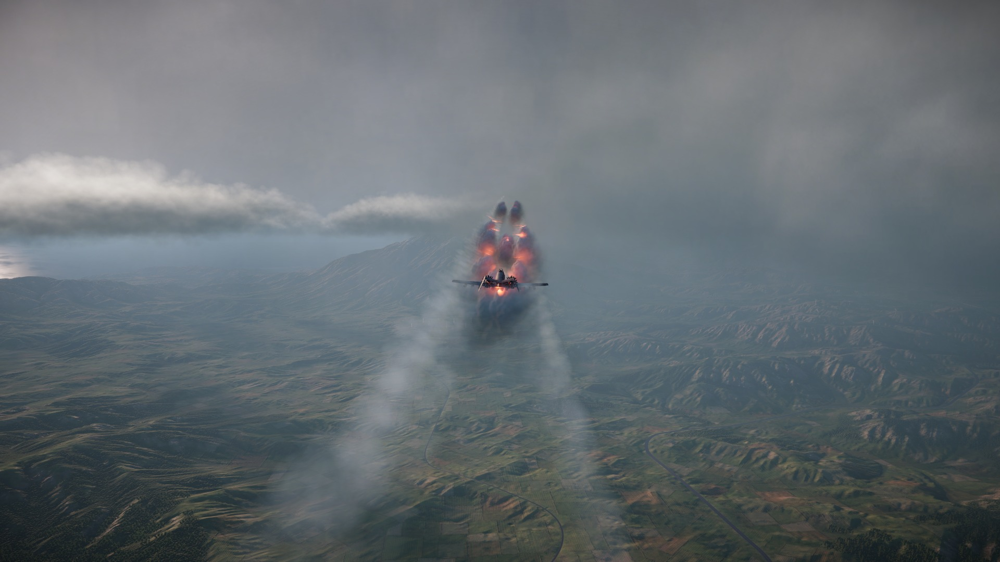
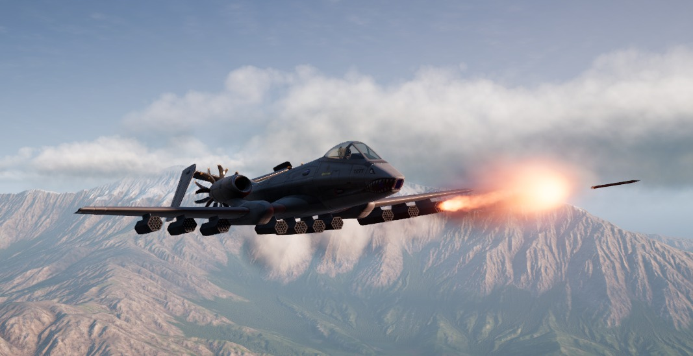
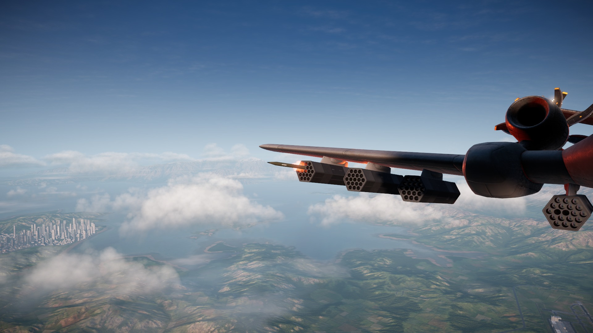
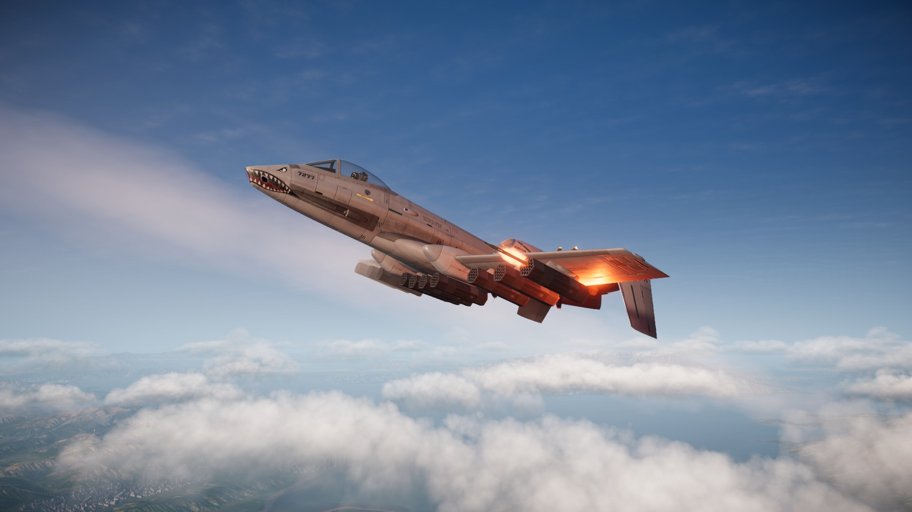

# AGR-31 Tenpin

**Unguided rocket pods for Nuclear Option, with a HUD that shows you where they land.**

📥 **[Download](https://github.com/mosdef31/NO-AGR-31-Tenpin/releases/latest)** &nbsp;·&nbsp;
📝 **[What's new](./CHANGELOG.md)** &nbsp;·&nbsp;
⚙️ **[Settings](./CONFIG.md)** &nbsp;·&nbsp;
🙏 **[Credits](./ATTRIBUTION.md)** &nbsp;·&nbsp;
📖 **[Lore](./LORE.md)** &nbsp;·&nbsp;
🐛 **[Report a bug](https://github.com/mosdef31/NO-AGR-31-Tenpin/issues)**

---

## What it is

### Air to ground

| Pod | Rockets | Loaded | Empty | Price |
|---|---|---|---|---|
| AGR-31 Tenpin x7 | 7 | 225 kg | 50 kg | $175k |
| AGR-31 Tenpin x18 | 18 | 565 kg | 115 kg | $450k |
| AGR-31 Tenpin x19 | 19 | 580 kg | 105 kg | $475k |
| AGR-51 Strike x4 | 4 | 315 kg | 55 kg | $240k |

- **AGR-31 Tenpin x7:** the light hex pod. Fits anything, including the stub pylons on a
  helicopter.
- **AGR-31 Tenpin x18:** the fast-jet drum. Slimmer, and the one the Shrike, King Viper,
  Compass and Vagrant carry.
- **AGR-31 Tenpin x19:** the heavy hex pod. The most rockets you can put on one pylon.
- **AGR-51 Strike x4:** a different weapon, not another pod. Four 133 mm rockets with
  five times the warhead of a 90 mm one, on the same aircraft as the x18. Their fins are
  folded in the tube and swing out just after launch.

They all fire the same unguided 90 mm rocket, which reaches a great deal further than the
stock ones. Load six pods on an A-19 and you put 42 rockets in the air in about three
seconds, or 114 in about nine.

They are not precision weapons. You fire them at an area from a long way out and let
volume do the work, which makes them good against SAM and AAA sites and poor against a
single hard target. The AGR-24 is still the better answer to a tank.

| | |
|---|---|
| Range | 15 to 20 km when lofted |
| Rocket | 90 mm, 2 m, unguided |
| Motor | 1.8 second burn |
| Warhead | 22.5 blast, 800 AP |
| Accuracy | 1.5 mrad, so the spread grows with range |
| Rate | one rocket every 0.08 s |
| Cost | $25k a rocket |

And the AGR-51 Strike:

| | |
|---|---|
| Rocket | 133 mm, 2.1 m, folding fins |
| Motor | 1.8 second burn |
| Warhead | 50 blast, 900 AP |
| Weight | 65 kg a rocket |
| Cost | $60k a rocket |

Four rounds is the whole of it. There is no second salvo and no saturating anything, so
each one has to be aimed. It uses the same HUD as the AGR-31.

Range depends a lot on how you launch. Fired from 500 m you get about 18 km; from 10 km
you get about 35 km, because the rocket keeps your speed and thin air slows it less. The
number above is what you get in normal use, not a maximum.

Hard to shoot down, on purpose. A defence can hit these, but it burns two interceptors
per rocket doing it, so a full salvo empties a launcher whether or not it connects.

## What it looks like

| | |
|---|---|
|  |  |
|  |  |

Two flights are recorded in [`video/`](./video): one firing on a map designation, one
against a target picked out of the cockpit.

## The HUD

The stock missile UI does not show you where an unguided rocket lands, so the pod draws
its own.

**Artillery mode** is for lobbing them at something you can see on the map. Open the map,
press **T** on a spot, which is marked on the map so you can see it took, and the HUD
shows where the salvo will land, how big the spread will be, how far you can reach, and
turns the cue green when you should fire.

**Direct mode** is for the gun run. It shows a moving impact point you fly onto.

**B** switches between them. A magnifier pops up as you close on the release point,
because a lofted shot puts the marks low on the screen right when you need to read them
carefully. Locking a unit overrides whatever you designated on the ground.

**A moving target is led for you.** Lock a ship or a convoy and the cue sits ahead of it,
with a line back to where it is now. Fly the cue, not the target, and the rockets arrive
with it.

**Targets on a hilltop are worth one extra habit.** The cue is honest about where the
rockets meet the ground, and on a peak that answer moves a long way for a small change of
attitude: a shot that clears the summit lands in the valley behind it. Rather than hunting
for the perfect release, fire on the cue and keep firing as the nose comes down through
it. The salvo walks up the slope onto the target and something in it connects. That is
what a saturation weapon is for.

## Help with the shot

Two settings that make a long shot easier to fly. They are meant to be used together.

**Release assist**, on by default. Designate a point, hold the trigger, and the pod fires
itself the moment the rockets will actually land there, instead of you judging it by eye.
Holding the trigger is what gives permission: nothing fires unless you are already holding
it, and letting go stops it at once. With nothing designated, or a target out of reach, the
trigger works exactly as it always has, so a gun run is unaffected. **U** turns it off and
on in flight, and the HUD reads AUTO while it is holding the trigger for you.

**Tilt assist**, off by default. You fly the heading, the pod flies the elevation. It adds
a small amount of pitch to bring the rockets onto the range you need, so lining up at 15 km
is a matter of pointing at the target rather than hunting for the right loft. Your own
stick is added on top and is never limited, so you can override it whenever you like.

Enable it in the settings, then arm it in flight with **Y**. The HUD reads TILT ARMED when
it is on and TILT while it is actually flying the shot. It only works once you are already
pointed roughly at what you designated, within about 30 degrees, so turning onto a target
is your own turn and it does not fight you on the way round. Raise `Tilt assist authority`
if it settles too slowly for you.

## AI aircraft use it too

AI aircraft carrying the pod know how to use it. They close to a range they can reach,
loft the shot, fire a salvo sized to what they are shooting at, and stay for another pass
or two before leaving. Against a convoy they aim at the column rather than walking from
vehicle to vehicle, and against a SAM site, a ship or a building they commit enough
rockets to matter.

This applies to both sides, so the pod is worth flying against as well as with.

## What carries it

The A-19 out of the box, plus the SAH-46 Chicane, UH-90 Ibis, T/A-30 Compass, VT-7
Vagrant and CI-22 Cricket, which already carry the AGR-24. Aryx's MiG-15, RAH-72 Knockout,
F-16M King Viper and F-99 Shrike too if you have them. You can add other aircraft in the
config by name.

Helicopters work but are the worst platform for it. Hovering, you have no speed to give
the rocket and cannot point the nose up, so you throw away most of the range.

## Install

You need **Nuclear Option 0.34**, **BepInEx 5.4.x**, and **Blueprinter**. This build
was made and flown against Blueprinter **2.0.0**.
Blueprinter is not optional; without it the mod does not load at all and you will see
nothing from it in the log.

Then copy one file into `BepInEx/plugins/`:

- `TenpinMod.dll`

That is the whole install. The models and textures are packed inside the DLL, so there is
no separate `.nobp` to place.

**If you tested an early build**, delete any loose `tenpin.nobp` from `BepInEx/plugins/`
and delete the old `com.tenpin.cfg`. A leftover bundle wins over the packed one, so you
end up flying new code against old assets.

## Settings

`BepInEx/config/com.tenpin.cfg`, created the first time you run it. The `[Advanced]`
block is diagnostic logging, off by default, and none of it changes how the weapon flies.

One worth knowing about: **`Silly effects`**, off by default. Off, the rockets use the
game's own effects. On, they get the ones made for this weapon: a **cyan through violet**
exhaust, sparks at ignition and a nozzle light. It looks nothing like the rest of the
game, which is exactly why it is opt-in. Sound is the same either way.

There is also **`Motor effect donor`**, which picks which stock missile's exhaust gets
borrowed when `Silly effects` is off. It is read per shot, so you can change it and see
the difference on the next ripple without restarting.

> If your config still has a `Fun effects` line, that is the old name for `Silly effects`
> and it no longer does anything. Delete it.

Everything else about how the weapon performs is fixed in the build.

Full list: [`CONFIG.md`](./CONFIG.md).

## Known issues

- **Helicopters are the weakest platform.** A hover has almost no reach.
- **Multiplayer is lightly tested.** Firing as a client works now, but only a little of it
  has been flown on two machines. If something looks wrong there, the log is worth sending.

## Background

There is a fictional history for the weapon in [`LORE.md`](./LORE.md) if you like that
sort of thing.

## AI use

I use an AI agent to help with coding, refactoring, asset modification, and authoring long
bodies of text and lore.

It raises the quality ceiling beyond what my own skills currently guarantee, while I learn
and develop them. Every decision, every number, and everything that ships is mine.

## About this source

`src/` is the mod's C# with the comments stripped, published so you can read what it does.
It is not a checkout you can build: the project file, the asset bundle and the local game
path are not here.

Two of the models here are not my work, and the credit is a licence condition rather than
a courtesy. See [`ATTRIBUTION.md`](./ATTRIBUTION.md) for whose they are and what the
licence requires.
